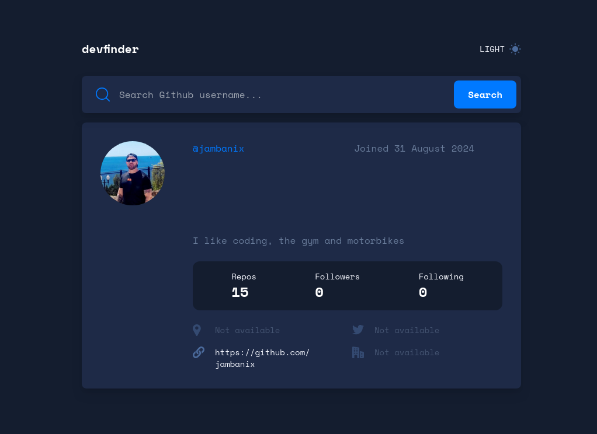

# Github User Search app

This is a solution to the [Github User Search app](https://www.frontendmentor.io/challenges/github-user-search-app-Q09YOgaH6). Frontend Mentor challenges help you improve your coding skills by building realistic projects.

## Table of contents

- [Overview](#overview)
  - [The challenge](#the-challenge)
  - [Screenshot](#screenshot)
  - [Links](#links)
- [My process](#my-process)
  - [Built with](#built-with)
  - [What I learned](#what-i-learned)
  - [Continued development](#continued-development)
- [Author](#author)

## Overview

### The challenge

- On first load, show the profile information for Octocat.
- Display an error message (as shown in the design) if no user is found when a new search is made.
- If a GitHub user hasn't added their name, show their username where the name would be without the `@` symbol and again below with the `@` symbol.
- If a GitHub user's bio is empty, show the text "This profile has no bio" with transparency added (as shown in the design). The lorem ipsum text in the designs shows how the bio should look when it is present.
- If any of the location, website, twitter, or company properties are empty, show the text "Not Available" with transparency added (as shown in the design).
- Website, twitter, and company information should all be links to those resaources. For the company link, it should remove the `@` symbol and link to the company page on GitHub. For Octocat, with `@github` being returned for the company, this would lead to a URL of `https://github.com/github`.

### Screenshot

### Links

- Solution URL: [Here](https://www.frontendmentor.io/challenges/github-user-search-app-Q09YOgaH6)
- Live Site URL: [Here](https://jambanix-frontendmentor-dev-finder.netlify.app/)

## My process

### Built with

- ReactJS
- Tailwind CSS
- Vite

### What I learned

This was my first project in React and Tailwind. It has been a good experience overall and I have learned a lot from it:

- Calling from an API
- How to build and deploy with Vite and Netlify
- State management
- Structuring a project
- Using Tailwind
- Using grid with Tailwind

### Continued development

I am going to do more of the Udemy courses before attemping another challenge, and also read up on more efficient ways to use Tailwind as I feel I was repeating myself a lot and there will be a better way of doing it

## Author

- Frontend Mentor - [@jambanix](https://www.frontendmentor.io/profile/jambanix)
